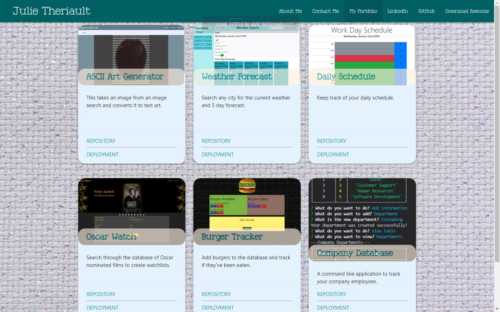
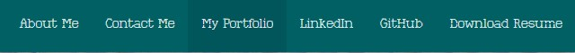

# Responsive Portfolio

## What it is

This is a portfolio to illustrate who I am as programmer and a person, to show what I can bring to the table in a coding environment

This portfolio was designed using HTML, javascript and the Materialize CSS framework.

## Where it is

The live deployment of this portfolio is located here <https://juliet2319.github.io/personal-portfolio/>

## How to use it

### About

The about me page provides a brief description of who I am and what I enjoy doing.

### Contact

This form will allow you to contact me regarding this project or any other project showcased here.

### Portfolio

This page showcases a selection of projects I have worked on.

### Other Links

In addition to the above noted pages, I have provided links to download my resume and my LinkedIn profile.
